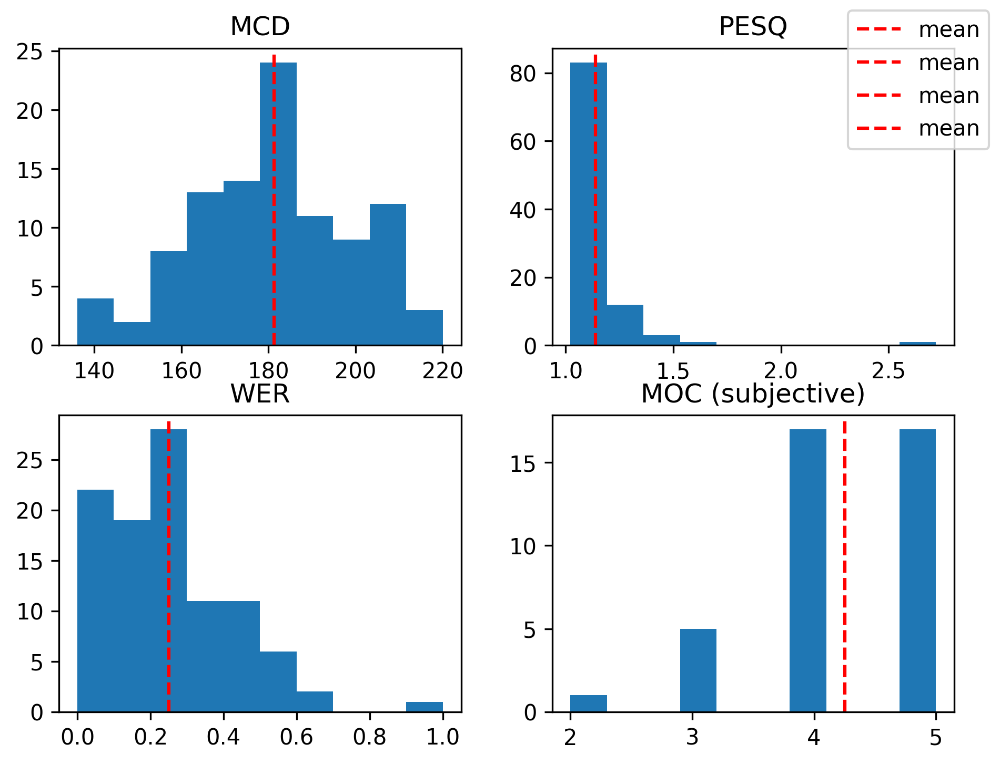

# Тестирование модели parler-tts-mini-jenny-30H
---

## Выбор датасета
Для тестирования модели `parler-tts-mini-jenny-30H` были выбраны датасеты со следующими характеристиками:
1. Различные длины теста: короткие отрывки и длинные предложения.
2. Различная синтаксическая и фонетическая сложность: предложения с разными грамматическими конструкциями, а также предложения не только с "простыми" словами, но и с названиями и нумерацией.

Для данных критериев хорошо подошли следующие датасеты:
1. `LJSpeech` - 7 книг, прочитанные одним диктором и разрезанные на фрагменты по 1-10 секунд
1. `VCTK` - датасет из озвучек 110 англоговорящих спикеров с различным акцентом

## Выбор описания
Для датасета `LJSpeech` вполне подходит описание диктора (`Jenny speaks at an average pace with an animated delivery in a very confined sounding environment with clear audio quality.`), предложенного в репозитории `parler-tts-mini-jenny-30H`, однако, это описание может быть наиболее эффективным для модели, поэтому стоит попробовать перефраз этого описания: `Jenny speaks at a moderate speed with lively intonation, in a somewhat enclosed-sounding space, but with clear audio quality.`.

Для датасета `VCTK` стоит также добавить описание акцента. Например: `Jenny speaks at an average pace with an animated delivery and **scottish accent** in a very confined sounding environment with clear audio quality.`

## Выбор метрик
Для оценки качества Text-To-Speech было выбрано два типа метрик: **субъективные** и **объективные**.

В качестве **субъективной** метрики была выбрана метрика `MOC`, которая считается путём оценивания человеком синтетичности сгенерированного голоса от 1 до 5.

В качестве объективных метрик были взяты:
1. `MCD` (`0.0 <= MCD (higher = better)`) - частотный анализ разницы между синтезом и оригиналом. Данная метрика, вероятно, покажет не сильно хорошие значения в виду различия пола дикторов и их тембра голоса.
1. `PESQ` (`-0.5 <= PESQ <= 4.5 (higher = better)`) - автометрика качества речи, основанная на восприятия речи человеческим слухом.
1. `WER` (`0.0 <= WER <= 1.0 (lower = better)`) - процент слов, неверно воспроизведенных моделью по сравнению с исходным текстом. Сравнивается с расшифровкой Wisper-а (по сути, автометрика). Wisper очень хорошо работает с чётким голосом, так что отклонения метрики из-за него можно считать незначительными.

## Результаты тестирования

К сожалению, в виду ограниченности вычислительных мощностей (железо у меня не очень сильное, а на `colab` всё время переполнялась оперативка) удалось померить метрики лишь на первых **100** элементах датасета `LJSpeech` и только с описанием `Jenny speaks at an average pace with an animated delivery in a very confined sounding environment with clear audio quality.` (проверка только на этом сетапе только объективных метрик заняла примерно два часа).

Средние значения:

| DataSet  | MCD | PESQ | WER   | MOC  |
|----------|-----|------|-------|------|
| LJSpeech | 181 | 1.13 | 0.249 | 4.25 |

## Выводы

По `WER` мы получили вполне приемлемый результат, если учесть, что `Whisper` тоже мог косячить.
По `MOC` мы получили хорошие значения, не смотря на то, что `PESQ` довольно мала. Возможно я очень лоялен =)
Скор `MCD` довольно мал, однако это скорее связано с различиями между голосами дикторов, нежели низким качеством модели.

В общим, модель показала удовлетворительные результаты на корпусе 100 записях из датасета LJSpeech, однако имеет место для улучшений.
